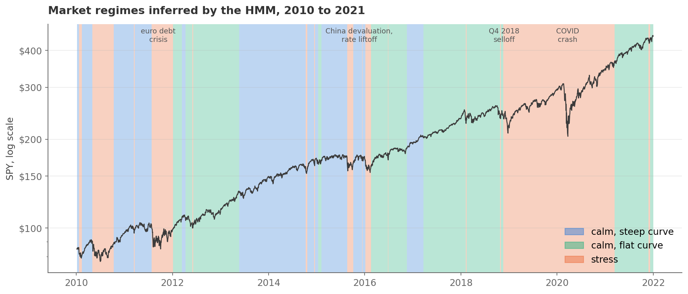
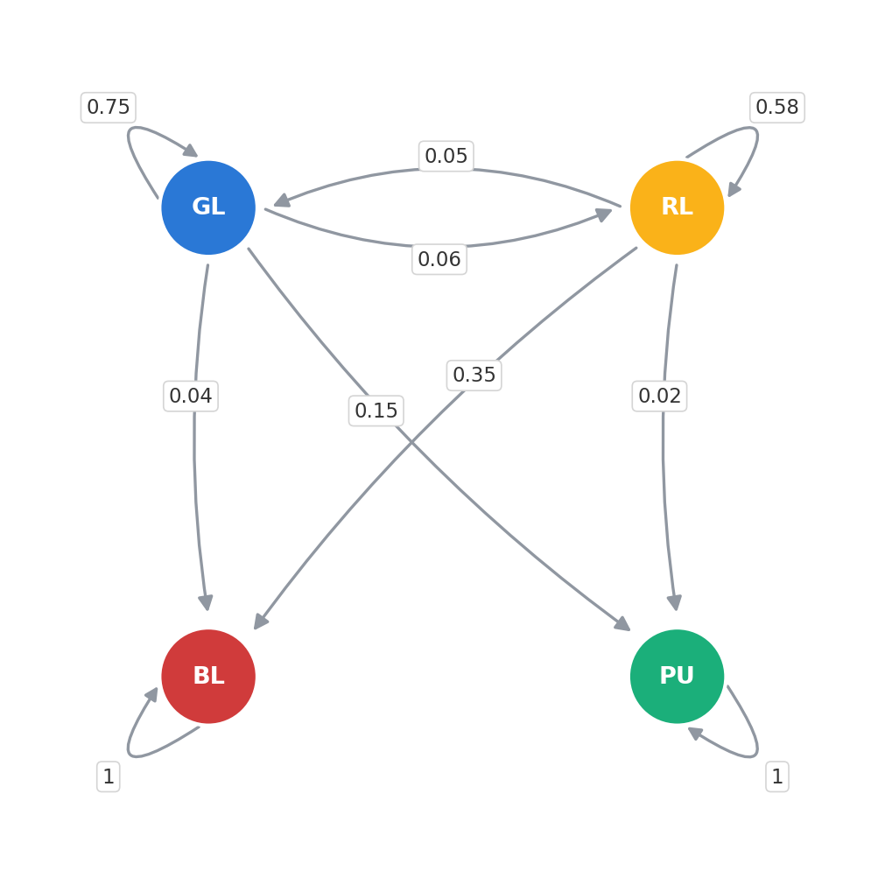

# Markov chains and hidden Markov models

A five-notebook tutorial that starts from "what is a state?" and ends in
places a first chapter on Markov chains never promises: the same matrix
that prices a loan book also predicts how often a multi-step AI agent will
finish its job, and what a customer retention program is worth in dollars.
It is written for someone meeting this material for the first time. If you can read basic
Python and you know what "a fair die shows a six one time in six" means, you
have the prerequisites; the linear algebra (one matrix product, one inverse,
one eigenvector) is introduced when it is needed and always translated back
into plain words.



## Why this repository exists

I first published this in 2020 as a single notebook. When I came back to it
in 2026, half of it no longer ran: the price API it depended on had shut
down, and two of its FRED data series had been discontinued or moved behind
a license. Fixing the plumbing was the excuse. The real reason for the
rewrite is that I wanted the tutorial to teach the way I now believe
technical material should be taught: build every idea from an example small
enough to check by hand, compute every important number twice by methods
that cannot share a bug (algebra against simulation, usually), and say out
loud what each model assumes and where it breaks. The notebooks apply that
standard even when the results are unflattering, and twice it caught
something genuinely wrong: a model-selection criterion that never converges,
and a fitted model that quietly stops making sense on data from outside its
training years.

The rewrite also connects the material to my current work. I spend my days
helping enterprises ship AI systems, and the most useful mental model I have
for agent reliability is the absorbing Markov chain. Notebook 04 makes that
concrete by reproducing the published numbers of my
[agent-failure-lab](https://github.com/netsatsawat/agent-failure-lab)
repository from a matrix inversion, and notebook 05 walks the same
mathematics into a revenue meeting.

## The notebooks, in reading order

Each one builds on the previous, and each ends on a real dataset or a real
system rather than a toy.

**[01 · Markov chains](notebooks/01_markov_chains.ipynb).** States, memory,
and the transition matrix. You compute a two-step probability by hand,
discover that matrix multiplication is that same hand calculation done for
every route at once, and watch a chain forget its own starting point. The
long-run distribution is computed two ways, an eigenvector and a
100,000-step random walk, and they agree to three parts in a thousand.

**[02 · Absorbing chains and credit risk](notebooks/02_absorbing_chains_credit_risk.ipynb).**
Some states you never leave: repaid, written off, churned. A four-state loan
book is pushed forward year by year until the brute-force approach shows its
limits, then the fundamental matrix N = (I - Q)^-1 answers everything at
once and exactly: a risky loan resolves in just under three years, defaults
88% of the time, and costs a computable number of dollars to service along
the way. A Monte Carlo simulation confirms every figure.

**[03 · Hidden Markov models](notebooks/03_hmm_regime_detection.ipynb).**
Markets have moods, but nobody rings a bell when one ends. An HMM treats
the regime as a hidden state behind observable symptoms (returns, the VIX,
the yield curve). The model is first vindicated on synthetic data where the
truth is known, then fitted to sixteen years of real data, where it finds a
stress regime that lands on every crisis you can name, and splits calm along
the rate cycle rather than anything price-based. The out-of-sample test
then catches the model overcalling stress for three straight years, and the
diagnosis of that failure (an inverted yield curve the training years never
contained) is the most valuable lesson in the notebook.

**[04 · Agents as absorbing chains](notebooks/04_agents_as_absorbing_chains.ipynb).**
A pipeline agent is an absorbing chain: steps are transient states, "done"
and "failed" are the exits, and retries or verification are edits to the
transition matrix. The fundamental matrix reproduces all six published
numbers of agent-failure-lab by assertion, then goes where closed forms
cannot: where failing runs die, which step repays engineering effort ten
times over, and what a fallback branch does to the arithmetic.

**[05 · Customer lifetime value](notebooks/05_customer_lifetime_value.ipynb).**
The business capstone. A subscriber base as a five-state chain: cohort
retention curves, the attrition structure a single monthly rate averages
away, and CLV as the fundamental matrix pricing customer-months. A
retention program is priced end to end before launch (net \$39 per new
customer, including the way the program inflates its own cost base), and
four competing initiatives get one honest ranking, in which the engagement
lever beats everything by an order of magnitude and the upsell push turns
out to be worth almost exactly nothing.

The `markov/` package holds the shared machinery: `AbsorbingChain`
(canonical form, fundamental matrix, absorption probabilities, expected
cost, and a Monte Carlo checker) plus the `MarkovChain` class that draws
the state diagrams. `tests/test_absorbing.py` covers the math against
closed-form cases.

## Where this applies in the real world

Every notebook runs on illustrative or public data, but each one is a
working template for a decision someone is paid to make. Swap in your
own transition counts (any CRM, loan book, or run log already contains
them) and the analysis carries over unchanged.

- **Credit and collections.** Banks maintain migration matrices exactly
  like notebook 02's, and the fundamental matrix turns them into
  expected default rates, time on book, and lifetime servicing cost per
  loan, the raw ingredients of provisioning and pricing. Stress testing
  is a matrix edit: fatten the default column and re-read the book.
- **Subscription economics.** Notebook 05 is the meeting where a
  retention program gets funded or killed: CLV per segment, the dollar
  value of one point of churn moved anywhere in the lifecycle, and a
  program's net value computed before launch. CLV is also the ceiling
  on what acquisition is allowed to cost, so the same number disciplines
  marketing spend. The states fit any recurring business: telco
  subscribers, SaaS seats, streaming accounts, insurance policies.
- **AI agent reliability.** Notebook 04's chain is how I reason about
  LLM pipelines in production: what an SLA is worth, whether retry or
  verification pays for itself, and which step deserves the fine-tuning
  budget. The live-model half of that argument is in
  [agent-failure-lab](https://github.com/netsatsawat/agent-failure-lab).
- **Market and macro monitoring.** Notebook 03's regime machinery
  supports risk dashboards and regime-conditional limits, and its
  out-of-sample failure is the more valuable export: a worked example of
  why any deployed unsupervised model needs drift monitoring and a
  refit schedule.
- **Anything with a terminal state.** Employee attrition, predictive
  maintenance (machine states ending in failure), clinical trial
  dropout, sales funnels ending in won or lost: the same five lines of
  linear algebra price them all.



## Running it yourself

```
python -m venv .venv && source .venv/bin/activate
pip install -r requirements.txt
python tests/test_absorbing.py
jupyter notebook notebooks/
```

Everything runs offline. The market and macro data ships in
`data/market_macro.csv` (SPY plus three open FRED series, 2010 to 2026), so
the results reproduce exactly as rendered. If you want a fresher snapshot,
`python data/build_dataset.py` rebuilds the file from sources that are
still fully open, and its docstring explains what happened to the two
series from the 2020 version that no longer exist.

## What changed since 2020

The original was one notebook with a loan example and an HMM fitted to GE
stock prices. This revision splits it into the five-part sequence above,
replaces the dead data sources with a bundled snapshot, adds the
fundamental-matrix treatment the loan example had been circling without
landing, makes the model-selection and out-of-sample honesty explicit, and
adds the bridges to AI agents and to customer economics. The concepts are the same; the answers are
now exact where they used to be approximate, and checked where they used to
be asserted.

---

Written by [Satsawat Natakarnkitkul](https://satsawat.ai), a data and AI
practitioner in ASEAN. If this repository is useful to you, my newsletter
[AI in Practice](https://satsawat.ai/#newsletter) covers the same ground:
evaluation, reliability, and local AI, with working code.

License: MIT
